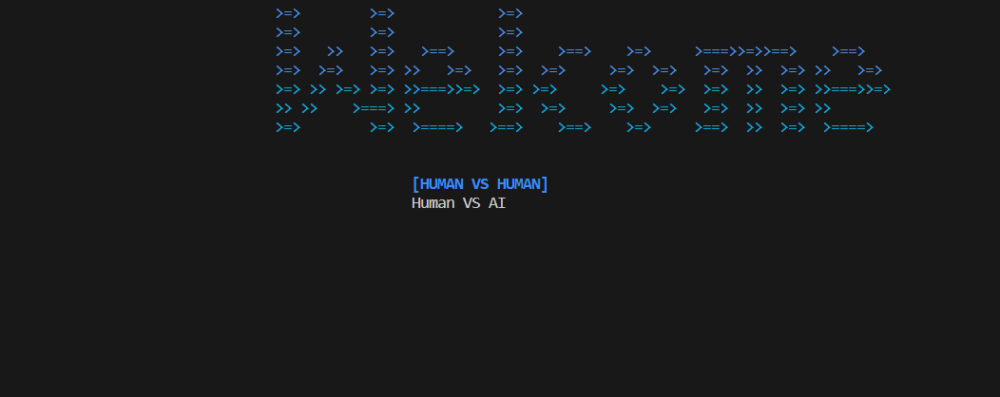
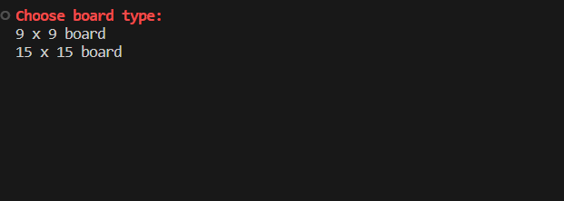
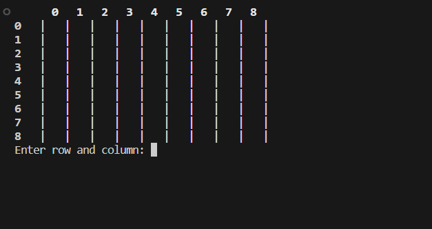
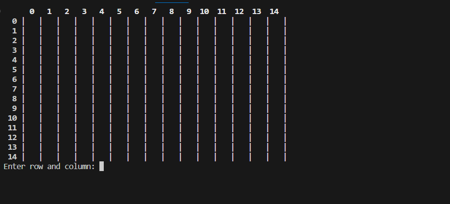
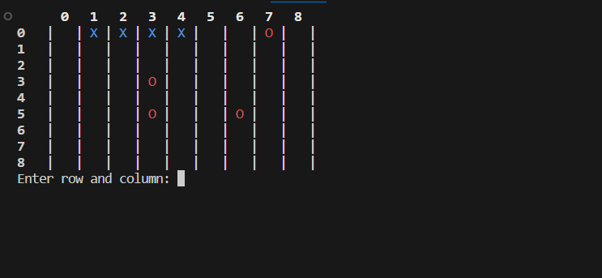

# strategic-five

- **Description:** Simple terminal-based game implemented in C++. The game was created using Visual Studio Code as the primary development environment.
- **How to Play:**
- Simple game that requires 5 consecutive appearance of a piece to win
  1. Clone this repository to your local machine.
     ```bash
     git clone https://github.com/abdullahejazjanjua/strategic-five.git
     ```
  2. Compile the C++ code using Visual Studio Code.
     - Open the project folder in VS Code.
     - Use the integrated terminal to run:
       ```bash
       g++ -o strategic-five strategic-five.cpp -lwinmm
       ```
  3. Run the game.
     ```bash
     ./strategic-five
     ```

## Screenshots

<p align="center">
  
</p>
<p align="center">
  You can choose between Human V Human OR Human VS AI
</p>

<p align="center">
  
</p>
<p align="center">
  You can choose between two types of boards
</p>

<p align="center">
  
</p>
<p align="center">
  This is how 9 x 9 board is printed
</p>

<p align="center">
  
</p>
<p align="center">
  This is how 15 x 15 board is printed
</p>

<p align="center">
  
</p>
<p align="center">
  This how you can enter your move
</p>

<p align="center">
  
</p>
<p align="center">
  Winner screen
</p>


## Technologies Used

Projects leverage a variety of technologies, including:
- Programming Languages: C++
- Development Environment: Visual Studio Code
- Tools: Git

## Acknowledgments

Gratitude to my instructors for guiding these projects, pivotal to my growth as a programmer.

Feel free to explore, provide feedback, or reach out. Thank you for visiting my Hangman Repository!
